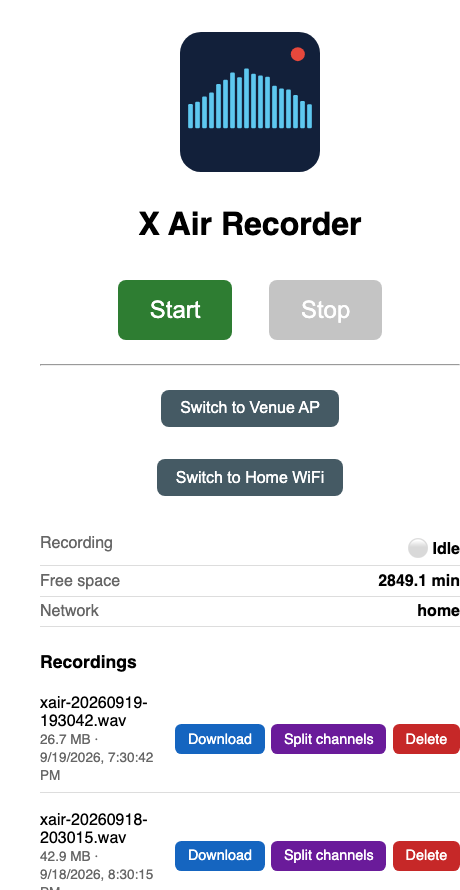

# X Air Recorder

Records all input channels of a Behringer X-Air series mixer (XR12, XR16,
XR18, X18, ...; USB Audio Class 2) to a single interleaved WAV file,
controlled remotely from a phone or laptop via a small web UI. Runs on any
Linux device with ALSA, `ffmpeg`, `systemd`, and NetworkManager — a Raspberry
Pi is a natural fit, but nothing in the code is Pi-specific. Built and tested
against the XR18; other X-Air models need only an environment variable or
two (see Setup) since it defaults to the XR18's card name/channel count.

No external dependencies: `recorder.py` and `webui.py` use only the Python
standard library.

## Motivation

We built this to record our band's rehearsals and shows without the hassle
of a laptop: a Raspberry Pi is small enough to live permanently inside our
X-Air mixer's rack case, powered whenever the mixer is. No laptop to carry,
no cables to remember, no one having to babysit a recording app — the Pi
just travels with the mixer, and whoever's near a phone can hit Start from
the web UI once things are plugged in and running.

## Why not existing software?

- **[Z-LiveRec](https://www.z-liverec.com/)** — a commercial app built for
  exactly this (XR18/X-Air → Pi), but proprietary and not obviously actively
  maintained.
- **[Ardour](https://ardour.org/)** — actively maintained, free, open source,
  but a full DAW — more setup and overhead than needed for "record everything,
  review later."
- A handful of small community scripts exist for this (X18-Recorder,
  caPiture) but see little to no ongoing maintenance.

This project is intentionally minimal: capture, browse, download, done.

## Features

- Captures all input channels (18 by default, for the XR18) as one
  interleaved 24-bit/48kHz WAV file via ALSA's `arecord` — no audio server
  (JACK/PulseAudio) required.
- Web UI: Start/Stop (mutually exclusive while a recording is active),
  live status, browse/download/delete recordings, split a recording into
  per-channel mono files on demand.
- CLI, for scripting or SSH use: `python3 recorder.py start|stop|status|split`.
- Self-hosted WiFi access point mode for use in places with no existing
  network (e.g. a venue), switchable at runtime without editing any config.
- Runs as a `systemd` service, auto-starting on boot.

## Requirements

- Linux with ALSA (`arecord`) and the mixer's USB cable plugged in — check
  `arecord -l` lists a card matching your mixer's name.
- `ffmpeg` (for the channel-split feature).
- `python3` (stdlib only, no `pip install` needed).
- `systemd`, to run it as a service.
- `NetworkManager` + a WiFi adapter that supports AP mode, if you want the
  venue/home network switching feature. Everything else works without it.

## Setup

1. Copy this repo to the device, e.g. `~/xair-recorder`.
2. Plug in the mixer and check how it identifies itself: `arecord -l` should
   list a card — note its name and how many USB channels you've configured
   it to send (X-Air USB routing is configurable on the mixer and doesn't
   have to match its total input count).
   - **XR18 (default, no config needed):** card name `XR18`, 18 channels.
   - **Any other X-Air device:** set two environment variables to match what
     `arecord -l` showed (see `XAIR_CARD_NAME`/`XAIR_CHANNELS` below) — no
     code changes needed.
3. Install and enable the web service:
   ```
   ./scripts/install-service.sh                # recordings default to ~/recordings
   # or: ./scripts/install-service.sh /mnt/recordings
   sudo systemctl start xair-recorder
   ```
4. (Optional) Set up the standalone WiFi access point for venue use:
   ```
   cd network
   sudo ./setup-ap-profile.sh <choose-a-wifi-password>
   ```
   This adds an inactive NetworkManager profile (SSID `XAir-Recorder`,
   `192.168.4.1`) — it does **not** touch your current network connection
   until you explicitly switch to it.

### Environment variables

| Variable | Default | Purpose |
|---|---|---|
| `XAIR_CARD_NAME` | `XR18` | ALSA card name to record from (`arecord -l`) |
| `XAIR_CHANNELS` | `18` | Number of channels that card sends over USB |
| `XAIR_REC_DIR` | `~/recordings` | Where recordings are written |
| `XAIR_WIFI_DEVICE` | `wlan0` | WiFi interface used for venue/home switching |

Set these in the systemd unit (`scripts/install-service.sh` writes
`XAIR_REC_DIR` there already; add the others the same way) or export them
before running the CLI directly.

## Using it



- Web UI: `http://<device-hostname-or-ip>:8080` — Start/Stop, live status,
  and a browsable list of recordings with Download/Split/Delete.
- CLI over SSH: `python3 recorder.py start|stop|status`.

Recordings land in `$XAIR_REC_DIR` (default `~/recordings`) as
`xair-YYYYMMDD-HHMMSS.wav`.

## Venue mode (no network available)

Once the AP profile is set up (see above), switch into it from the web UI
("Switch to Venue AP") or the CLI/SSH:

```
python3 recorder.py venue-mode
```

This saves whatever network was active beforehand and switches the WiFi
device into the `XAir-Recorder` access point (`192.168.4.1`). Join that
network from a phone/laptop and use the web UI as normal. Switch back with
"Switch to Home WiFi" in the UI, or:

```
python3 recorder.py home-mode
```

**Caveat:** switching to AP mode drops the device off whatever network it was
using (including any SSH session running over it) — expect that, and do it
right before you actually need venue mode, not as a test from a remote shell
you still need.

## Getting recordings off the device

```
scp <user>@<device>:~/recordings/xair-*.wav .
```

Most DAWs (e.g. Logic Pro, Reaper) can import the interleaved multichannel
WAV directly and split it into per-channel tracks on import. If you need
separate mono files for something that can't do that, use the "Split
channels" button in the web UI, or:

```
python3 recorder.py split /path/to/xair-20260913-120000.wav
```

## Development

```
make test      # run the test suite (stdlib unittest, no deps)
make check     # tests + Python/JS syntax validation
```

See [ARCHITECTURE.md](ARCHITECTURE.md) for how the pieces fit together and
why some of the less-obvious design decisions were made.

## Deploying to a device

Copy `config.mk.example` to `config.mk` (gitignored) and fill in your
device's host/path, then:

```
make deploy   # validates, rsyncs, restarts the service
```

Other targets: `make status`, `make logs`, `make restart`, `make ssh`. Run
`make` targets without `config.mk` and they fall back to generic placeholder
values (`pi@raspberrypi.local`, etc.) — harmless, just point them at your own
device first.

## License

MIT — see [LICENSE](LICENSE).
